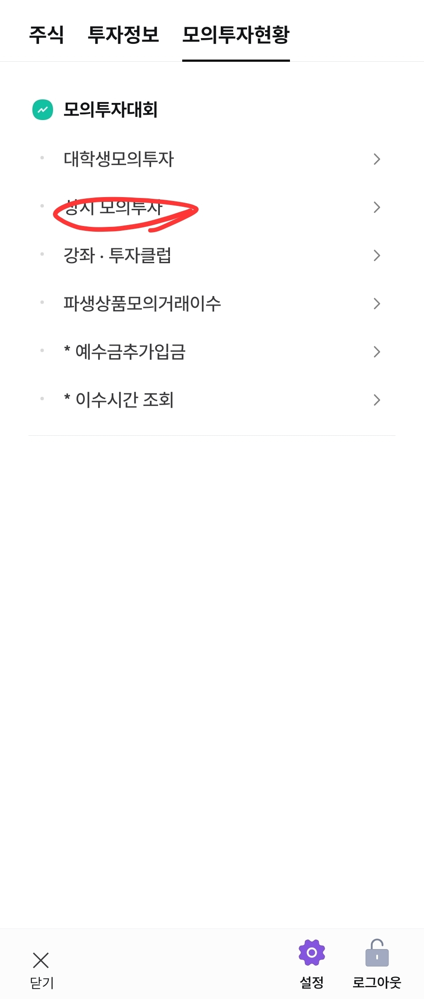
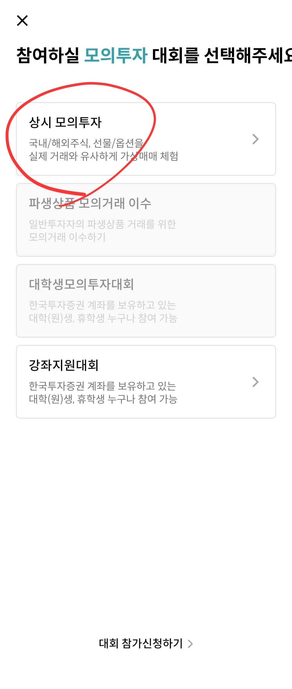
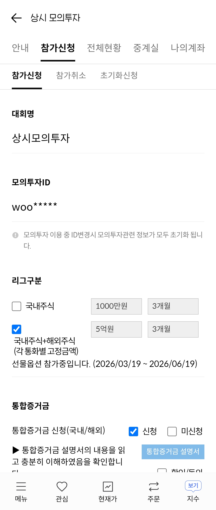
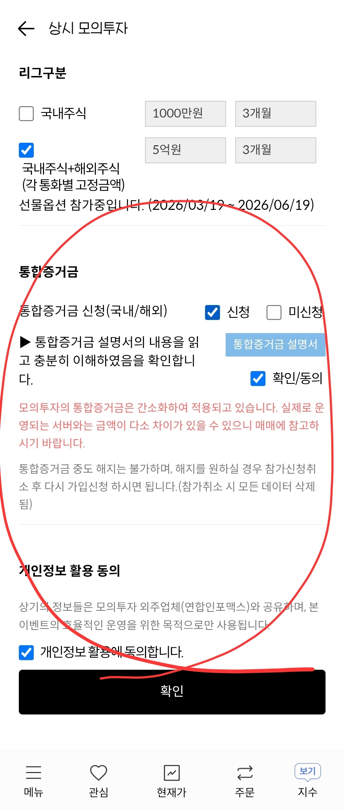
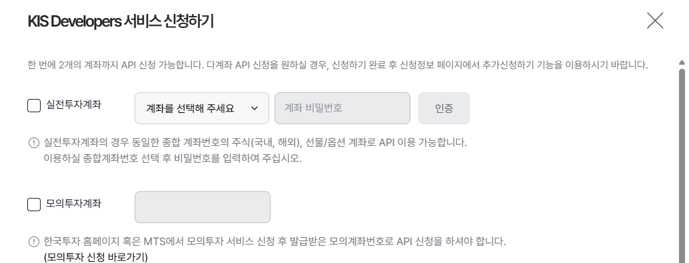
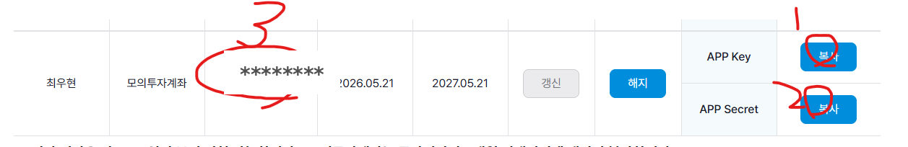

<!-- _class: lead -->

# AI로 모의 주식 매매해보기

**Claude Code 로 주식을 사고팔아 본 지난 2달의 기록**

2026.06.04 (수) · 약 1시간

---

## 오늘 1시간

| 분량 | 내용 |
|---|---|
| **15분** | 발표 — 2달 운영 복기 + 시스템 구조 + Claude Code 라이브 시연 |
| **30분** | 실습 — 각자 노트북에서 직접 자연어로 주식 매수해보기 |
| **15분** | QnA · 자유 실험 · 마무리 |

**오늘의 목표**: "AI 도구로 진짜 매매 환경을 다뤄봤다" 는 경험 한 번씩 가져가기

---

## 지난 2달 — 6개 전략을 시도했습니다

| 전략 | 어떻게 | 현재 |
|---|---|---|
| **A. 컨센서스 자동매매** | 액티브 ETF 35개 동시 보유 종목 → Top 20 자동 매수 | ✅ 가동 |
| **B. PRISM 5-Layer 리서치** | Claude 가 매주 2회 후보를 5단계로 분석 | ✅ 가동 |
| **C. PRISM-C 단타 스윙** | 거래량 + 토스 인기순위 신호로 5분 스캔 | 🧪 페이퍼 운영 |
| D. PRISM-D 종가매매 | 종가 기준 백테스트 → 실서비스 진행 | ⏸ 백테스트에서 멈춤 |
| E. 패시브 ETF only | 액티브 빼면 알파 ↑? 4주 paper 측정 중 | 🧪 측정 중 (6/05 결정) |
| F. 신규상장 ETF 즉시편입 | +1d 평균 -0.46% → 즉시 자동매매 폐기, 4주 paper | 🧪 측정 중 |

자동매매로 진짜 돌아가는 건 2개. 나머지 4개는 데이터로 **"아직 알파 검증 안 됨"** 확인하고 멈춤 또는 페이퍼.

→ "5개 다 돌리겠다"는 처음 목표였고, 검증·실패·재설계 거치면서 위 표가 남았습니다.

---

## 어디서 막혔나 — 5가지

**① 컨센서스만 보면 결국 대형주 쏠림**
액티브 ETF 35개가 동시에 담는 종목 = 삼전·하이닉스 같은 "이미 다 아는 종목" 만 나옴.
→ 최근 출시 ETF에 가중 + 시간감쇠로 신선한 ETF 우대 → 187개 후보까지 분산

**② 토스 인기순위로 단타 신호 만들기 (PRISM-C)**
가설 — "갑자기 사람들이 토스에서 많이 보는 종목" 이 단기 모멘텀 신호일까?
거래량 폭발 + 토스 인기 상승 → 5분마다 스캔, 페이퍼 매매로 검증 (작동 원리는 다음 슬라이드)

**③ Budget B 1천만 → 예수금이 자꾸 쌓임**
포트폴리오 5% 비중 = 50만. 그런데 삼성SDI(63만)·두산(155만) 같은 종목은 **1주도 못 사**.
→ LLM은 "76% 매수해라" 했는데 실제 55%만 매수. 약 350만이 예수금에 묶임.
→ 1천만 버짓의 구조적 한계 (해결책: 증액 or 종목수 축소, 미적용)

**④ LLM 한테 물으면 거의 다 "사라"**
Claude에게 종목 분석시키면 매수 의견이 너무 많이 나옴 (낙관 편향).
→ "Hold면 비중 0%" 룰 강제 + 같은 데이터로 두 번(편향 ON/OFF) 돌려서 차이 확인
→ A/B 비교 결과: 같은 종목에 **+1% vs -1.5%** 반대 의견. LLM 답을 그대로 안 믿게 됨.

**⑤ 패시브 ETF만 볼까, 액티브 포함할까**
가설: KODEX·TIGER 같은 **패시브** ETF가 신규자금 알파를 더 잘 잡음 (관찰: 패시브 +5.5% / 액티브 −1.3%).
시도: 액티브 빼고 컨센서스 다시 짜는 시나리오 매주 자동 시뮬.
1주차: 패시브 안정성 95% (vs 현행 85%) — BUT 3일 짧은 페이퍼에선 **−1.86%p** 짐.
→ 4주 누적 측정 후 **6/05 에 패시브 only 전환 여부 결정**

---

## PRISM-C — 단타 봇이 어떻게 작동하나

**가설**: "거래량 폭발 + 토스 인기 상승 = 진짜 돈 + 진짜 관심"
한 종목 혼자 떠오르면 작전일 수 있지만, 두 신호가 같이 뜨면 진짜 신호일 가능성 ↑

**스캔 사이클** (장중 09:30 ~ 14:30, **5분마다**)

| 단계 | 무엇을 보나 |
|---|---|
| 1. 후보 | 컨센서스 Top 30 종목 |
| 2. 거래량 z-score | ≥ 1.2 (5일 평균 대비 폭발) |
| 3. 토스 인기 z-score | ≥ 1.2 (5일 평균 대비 인기 급등) |
| 4. 양봉 + 섹터 양봉 비율 | 악재 종목 제외 |
| 5. 두 신호 동시 발화 | 시장가 즉시 매수 |

**청산 룰**: **+2.5% 익절** / **−1.5% 손절** / **2일 보유 후 강제 종료** / 트레일링 +3%

**측정 방식**: 페이퍼 트레이딩으로 3개 시나리오 동시 비교 — `a` 거래량만 / `b` 토스만 / `c` 결합(AND).
→ 결과로 "결합이 더 강한 신호인가" 직접 검증. 알파 확인되면 모의계좌 실집행.

---

## 지금 결과 (5/21 기준)

**Budget A (컨센서스 자동매매)**

| | 평가 |
|---|---:|
| 보유 cost | 8.50m |
| 현재 평가액 | 12.64m |
| 미실현 수익률 | **+48.81%** |
| 같은 기간 KOSPI (4/10~) | +33.40% |
| **KOSPI 대비 알파** | **+15.41%p** ✅ |

**Budget B (PRISM 5단계 리서치)**

| | 평가 |
|---|---:|
| 보유 cost | 5.77m |
| 현재 평가액 | 6.92m |
| 미실현 수익률 | +19.93% |
| 같은 기간 KOSPI (4/24~) | +20.69% |
| **KOSPI 대비 알파** | **−0.76%p** (시장 수준) |

**PRISM-C 페이퍼 (단타 스윙, 5/4~5/21)**

| 시나리오 | 시도 | 승률 | 시도당 | 총 P&L |
|---|---:|---:|---:|---:|
| a · 거래량만 | 23 | 61.9% | +1.06% | **+22.36%** |
| b · 토스 인기만 | 22 | 60.0% | +1.03% | +15.44% |
| c · 결합 (a AND b) | 7 | 42.9% | +0.34% | +2.4% |

→ 흥미로운 발견:
- 강세장에서 **컨센서스 자동(A)이 KOSPI 대비 +15%p 초과수익**
- 더 깊게 분석한 PRISM(B)이 오히려 KOSPI 수준
- 단타 신호도 "결합이 더 강하다" 가설은 약화. 단일 신호가 더 잘 나옴

---

## 자동매매 스케줄 (cron 자세히)

매주 / 매일 사람 손 없이 도는 스케줄:

| 시점 | 무엇이 돕니까 |
|---|---|
| 매주 **금 08:43** | ETF 35개 전수 스크래핑 → 컨센서스 187종목 갱신 |
| 매주 **월 09:07** | Budget A 리밸런싱 (컨센서스 Top 20 자동 매수/매도) |
| **월·목 05:00** | PRISM 5-Layer 리서치 (Claude가 헤드리스로 자동 분석) |
| **월·목 09:07** | Budget B 리밸런싱 (PRISM 포트폴리오대로) |
| **매일** 09:00~15:25 (5분마다) | PRISM-C 단타 스캔 (페이퍼) |
| **매일** 15:40 | 매집 시그널 스캔 → JSON 기록 |
| **매일** 08:00 | 잔고·수익률 리포트 → 텔레그램 자동 발송 |

→ 사용자가 노트북 안 켜도 자동 매매·리포팅. 모든 결과는 텔레그램 그룹에 도착.

---

## 자연어 매매 + 텔레그램 통합

평소엔 cron 으로 자동, **즉시 필요할 땐 텔레그램 한 줄**:

```
[텔레그램 그룹 채팅]
> @봇 엔비디아 1주 매수해줘
↓
Claude가 도구 골라 호출 → KIS API → 모의계좌 체결
↓
> @봇 그룹에 결과 알려줘
(계획 → 결과 → 의도 → 진행 4단 자동 리포트)
```

**핵심 차별점**:
- 기존: 사람이 코드 → 사람이 실행 → 사람이 해석
- 이번: 사람이 자연어 → **Claude 가 도구 골라 호출**

**자동화 ↔ 즉시 조작 양립**:
- 정해진 흐름은 cron 으로
- 그 외엔 텔레그램 한 줄로 즉시 매매·잔고·신호 분석 가능
- 그룹 멤버 누구나 사용 (모의계좌라 안전)

도구 9개를 미리 만들어두면, Claude 는 사용자 의도만 보고 어떤 도구를 어떻게 부를지 알아서 결정.

---

## 도구 (MCP) 9개 — 워크샵용으로 **직접 만든** 키트

**매매 — kis-broker** (한국투자증권 API 래퍼)
- get_stock_price · get_balance · buy_stock · sell_stock (한국)
- get_overseas_stock_price · get_overseas_balance · buy_overseas_stock · sell_overseas_stock (미국)

**신호 — signals** (알고리즘 신호 추출, **직접 구현**)
- golden_cross_signal — 5/20 이동평균 (한국·미국 자동 판별)
- dart_recent_disclosures — DART 최근 N일 지분공시
- insider_buying_signals — 임원·주요주주 순매수만 필터링

→ Claude는 사용자 자연어를 보고 **이 9개 도구 중 어떤 걸 어떤 인자로 호출할지** 알아서 결정.
워크샵 키트 (`quant-claude-workshop`) 에 다 들어있습니다. Codespace 띄우면 자동 로드.

---

## 라이브 시연 — 자연어로 매수까지

(화면 전환 · 약 5분)

### 시나리오 1 — 단순 매수
```
> 엔비디아 현재가 알려줘
> 1주 매수해줘
```

### 시나리오 2 — 알고리즘 신호 + 매수
```
> 엔비디아 골든크로스 신호 어때?
> 신호 좋으면 1주 매수해줘
```

### 시나리오 3 — 공시 기반 매수
```
> DART 공시 찾아봐서 내부자 매수 시그널 있는 종목 알려줘
> 가장 강한 시그널 1주 매수해줘
```

---

## 그래서 어디까지 자동인가

| 단계 | 자동? |
|---|---|
| 종목 발굴 (스크래핑·컨센서스) | ✅ 매주 자동 |
| 후보 깊은 리서치 (PRISM 5-Layer) | ✅ 주 2회 자동 (Claude 헤드리스) |
| 매수 주문 | ⚠️ **사용자 확인 후** 자동 |
| 일일 리포트 | ✅ 매일 텔레그램 자동 |

**원칙**: 의사결정 (매수/매도) 은 항상 사용자 확인. Claude 가 후보까지만 제시.

---

## 이제 여러분 차례 — 실습 30분

본인 노트북 열고 같이 해봅니다. **사전 준비 4가지** (합 약 50분):

- ✅ **GitHub 계정** (무료, 5분)
- ✅ **KIS 모의투자 + API 키** (30분 — 다음 2장에 스크린샷으로 자세히)
- ✅ **Anthropic Claude Pro** ($20/월, 5분 · 한 달만 결제해도 OK)
- ✅ **노트북** (Mac/Win/Linux 다 OK — 브라우저만 있으면 됨)

준비 안 되신 분도 OK — 옆 사람 화면 같이 보면서 흐름만 따라오셔도 됩니다.

→ 사전 준비는 워크샵 **전**에 본인이 하는 것. 당일은 Codespace 띄우고 `./setup.sh` 만 실행.

---

## KIS 모의투자 신청 (스마트폰 MTS) · 약 10분

워크샵이 저녁이라 한국장 마감 후. **국내+해외 5억원 / 3개월** 으로 신청해서 미국 종목까지 거래.

<div class="step-grid">
<figure><figcaption><strong>a.</strong> 메뉴 → 모의투자현황 → 상시 모의투자</figcaption></figure>
<figure><figcaption><strong>b.</strong> 상시 모의투자 카드 선택</figcaption></figure>
<figure><figcaption><strong>c.</strong> 국내+해외 5억원 / 3개월 체크</figcaption></figure>
<figure><figcaption><strong>d.</strong> 통합증거금 + 동의 + 확인</figcaption></figure>
</div>

→ 신청 완료 후 **모의계좌번호** (8자리 숫자, 예 `50189***`) 가 발급. 다음 단계에서 사용.

---

## KIS Developers 포털에서 API 키 발급 · 약 10분

[apiportal.koreainvestment.com](https://apiportal.koreainvestment.com/) 회원가입 → 모의투자계좌 등록 → 키 3개 발급.

<div class="step-grid cols-2">
<figure><figcaption><strong>a.</strong> KIS Developers 서비스 신청 → 모의투자계좌 체크 → 8자리 계좌번호 입력 → 인증</figcaption></figure>
<figure><figcaption><strong>b.</strong> 발급 완료 — APP Key · APP Secret · 계좌번호 (3개) 복사·메모</figcaption></figure>
</div>

> 이 **APP Key · APP Secret · 계좌번호** 3개가 워크샵 당일 `./setup.sh` 에서 필요합니다.
> 모의투자라 진짜 돈은 안 들지만, 키는 다른 사람에게 안 보이게 보관.

---

## 워크샵 당일 — Codespace 띄우고 4단계

**Step 1 — Codespace 띄우기 (2분)**
`github.com/woogamer/quant-claude-workshop` → 우상단 `<> Code` → **Codespaces** 탭 → **Create codespace**
→ 1~2분 부팅. 브라우저 안에 VS Code + 터미널 자동 오픈.

**Step 2 — KIS 키 입력 (3분)**
```bash
./setup.sh
```
APP Key · APP Secret · 계좌번호 (`50012345-01` 형식) · DART 키 (선택, 엔터 스킵 OK).

**Step 3 — 연결 확인 (1분)**
```bash
python scripts/demo_price.py 005930
```
"삼성전자 현재가 ... 정상 연결 확인 완료" 가 뜨면 OK.

**Step 4 — Claude Code 실행 → 자연어 매매**
```bash
claude
> 엔비디아 현재가 알려줘
> 골든크로스 신호 어때?
> 1주 매수해줘
```

→ 막히는 거 있으면 손 들어주세요. 자주 막히는 5가지는 `docs/SETUP_GUIDE.md` 에 정리.

---

## 워크샵 이후

- **키트 레포는 그대로 유지**. 본인 fork 떠서 자유롭게 이어가셔도 됩니다.
- **자동매매 시스템**도 계속 돕니다. 분기 1회 정도 결과 공유 예정.
- **더 깊게 하고 싶은 분**은 진행자에게 알려주세요 — keep in touch 그룹 안내.

오늘 이 자리가 AI 도구를 처음 매매에 붙여보는 첫걸음이 되었으면 합니다.

**감사합니다.**
